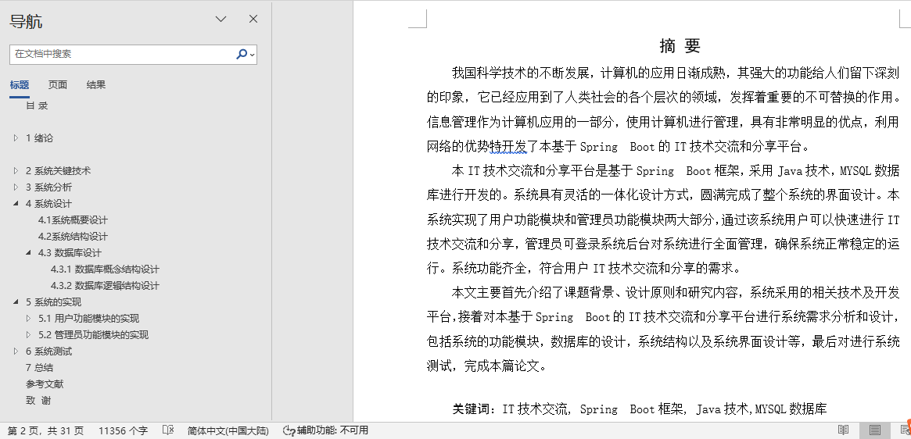
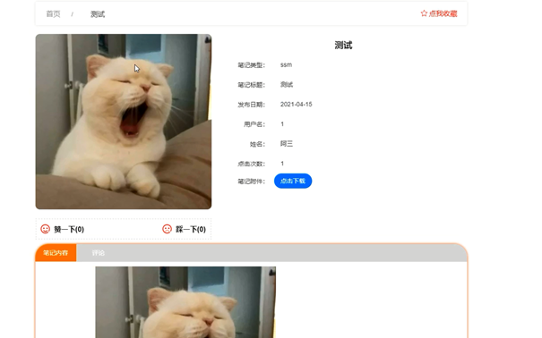
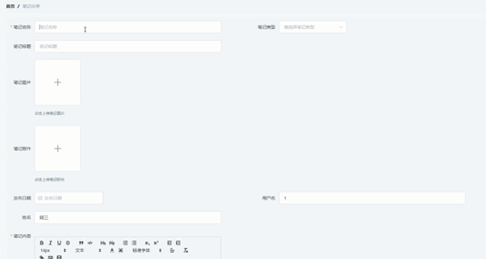
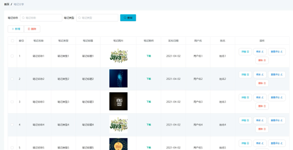

## 基于SpringBootIT技术交流和分享平台(程序+报告)

###  获取sql数据库文件: 从戎源码网 (https://armycodes.com/) QQ: 386869957 QQ群: 377586148
###  所有系统地址: (https://github.com/YuLin-Coder/AllProjectCatalog) 
###  所有项目以及源代码本人均调试运行无问题 可支持远程安装部署调试、定制修改、代码讲解

## 项目介绍
基于SpringBootIT技术交流和分享平台，系统包含两种角色：用户、管理员，系统分为前台和后台两大模块，主要功能如下：

### 【管理员】:
管理员登录界面  
管理员需通过登录界面进入系统后台，进行系统管理操作。

用户管理界面  
管理员在用户管理界面可查看所有用户信息，并对其进行编辑和删除操作。

笔记类型管理界面  
管理员可在此界面对笔记类型信息进行增删改查操作，管理笔记分类。

笔记分享管理界面  
管理员可在此界面对笔记分享信息进行增删改查操作，管理用户发布的笔记内容。

### 【用户】:
系统前台主界面  
用户在系统前台可查看系统信息，展示整体系统功能和布局。

用户注册界面  
没有账号的用户可在注册界面进行注册操作，输入必要的信息完成账号创建。

用户登录界面  
用户在登录界面输入登录信息，点击登录按钮进行系统登录。

笔记分享详情界面  
用户可选择笔记分享查看详细信息，了解具体内容和相关评论。

添加笔记分享界面  
用户登录后可在此界面添加新的笔记分享信息，发布自己的笔记内容。

我的收藏界面  
用户可在此界面管理个人收藏的笔记分享信息，查看和删除收藏的内容。

## 项目技术
- 编程语言：Java
- 数据库：MySQL
- 项目管理工具：Maven
- 前端技术：HTML、CSS、JavaScript、Jquery、Vue
- 后端技术：Spring、SpringMVC、MyBatis

## 运行环境
- JDK版本：JDK1.8及以上
- 开发工具：IDEA、Ecplise、Myecplise都可以
- 数据库: MySQL5.7及以上
- Maven：maven3.0及以上
- Node：14.14.0及以上

## 运行截图

